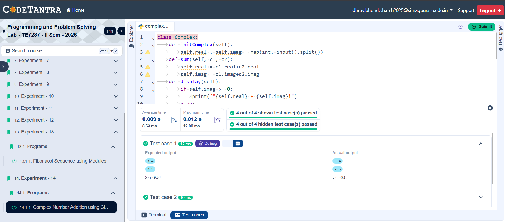

## Problem Statement
Write a Python program using a class named Complex to add two complex numbers.

---

## Algorithm
Step 1: Start

Step 2: Create three objects:
            c1, c2, c3 of class Complex

Step 3: Input first complex number:
            Read real and imaginary part
            Store in c1.real and c1.imag

Step 4: Input second complex number:
            Read real and imaginary part
            Store in c2.real and c2.imag

Step 5: Compute sum:
            c3.real ← c1.real + c2.real
            c3.imag ← c1.imag + c2.imag

Step 6: Display result:
            If c3.imag ≥ 0
                Print: c3.real + c3.imag i
            Else
                Print: c3.real - |c3.imag| i

Step 7: Stop
---

## Flowchart

---

## Execution

  

